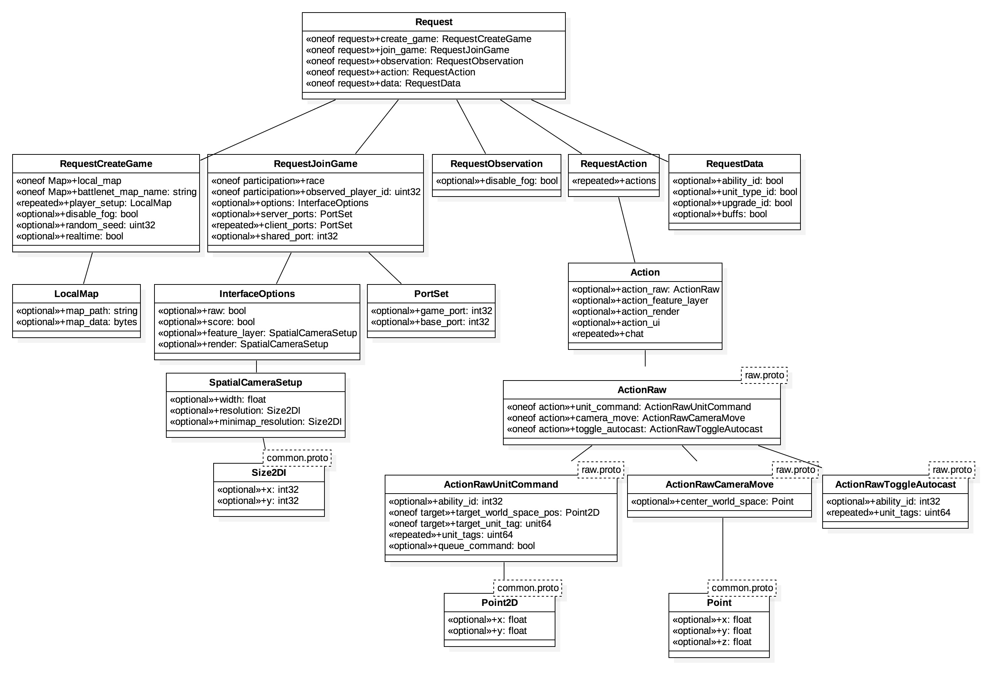

# How to Test
This document is about how to use sc2client-proto messages to write and run your program. Besides, This article is based on `protobuf` syntax.
If you wonder how to use it, [protobuf tutorial](https://developers.google.com/protocol-buffers/) will be helpful.

1. Launch SC2 with SC2Switcher. Set the port number 5000 to listen the message.
2. Write down your code. Before you read below lists, I recommend to see the hierarchy of sc2 protobuf msg.
    
	1. Create Connection
		We have to connect with SC2. Using `websocket`, we can connect and send messages.
		```
		conn = websocket.create_connection("ws://%s:%s/sc2api" % (address, port), timeout=60)
		```
		Address would be `localhost`, and `host` could be any number. we used `127.0.0.1` for address, and `5000` for port.


	2. Create New Game
	    To create new game, we also need the msg to request SC2 to make new game.
	    The following is the protobuf msg format of request to create game.
	    ```
	    message RequestCreateGame {
            oneof Map {
                LocalMap local_map = 1;                         // Local .SC2Map file
                string battlenet_map_name = 2;                  // Map published to BattleNet
            }

            repeated PlayerSetup player_setup = 3;

            optional bool disable_fog = 4;

            optional uint32 random_seed = 5;                  // Sets the pseudo-random seed for the game.
            optional bool realtime = 6;                       // If set, the game plays in real time.
        }
        ```

	    The sc2api require us the map info to make the new game. You can choose the way to give info of map which you want to use.
	    If you want to use your local map file, you need to fill the below structure.

	    ```
	    message LocalMap {
            // A map can be specified either by a file path or the data of the .SC2Map file.
            // If you provide both, it will play the game using map_data and store map_path
            // into the replay. (260 character max)
            optional string map_path = 1;
            optional bytes map_data = 7;
        }
        ```

        Also, you can setup the players with following msg.

        ```
        message PlayerSetup {
            optional PlayerType type = 1;

            // Only used for a computer player.
            optional Race race = 2;
            optional Difficulty difficulty = 3;
        }
        ```

	    Our example is below. You can check the entire code in `src/example/game.py`

	    ```python
        map_info = sc_pb.LocalMap()
        #Windows
        #map_info.map_path = "C:\Program Files (x86)\StarCraft II\Maps\Melee\Simple128.SC2Map"
        #Mac
        map_info.map_path = "/Applications/StarCraft II/Maps/Melee/Simple128.SC2Map"
        create_game = sc_pb.RequestCreateGame(local_map = map_info)
        create_game.player_setup.add(type=1)
        create_game.player_setup.add(type=2)

        create_game.realtime = True
        print("Make")

        #send Request
        print(test_client.comm.send(create_game = create_game))
	    ```

	3. Join to New Game
        After creating game, you have to join the game to start. The following protobuf msg definition is about joining game msg.
        You don't have to set the port because it is optional.
        ```
        // If successful, puts the game into the status: in_game. Will be able to
        // request actions, observations and step the game.
        message RequestJoinGame {
            oneof participation {
                Race race = 1;                          // Join as participant
                uint32 observed_player_id = 2;          // Join as observer
            }

            optional InterfaceOptions options = 3;    // This is limited to what is specified in RequestCreateGame, but you can request less information if you want.
            optional PortSet server_ports = 4;        // Do not set in the single-player case. This is the port a server will use.
            repeated PortSet client_ports = 5;        // Do not set in the single-player case. These are the ports clients will use to initialize communication.
                                                      // Currently only a singe client is supported.
            optional int32 shared_port = 6;
        }
        ```

        The example is creating game between one user and one computer. `race = 3` means `Protoss`.

	    ```python
	    interface_options = sc_pb.InterfaceOptions(raw = True, score = False)
        join_game = sc_pb.RequestJoinGame(race = 3, options = interface_options)

        #send Request
        test_client.comm.send(join_game=join_game)
        #print (test_client.comm.read())

        #Game Start
        print(test_client.comm.send(step = sc_pb.RequestStep(count = 1)))
        #print (test_client.comm.read())
	    ```
    4. Order the Action
        If you success to send RequestJoinGame msg and get the response, You may see the loading screen on your SC2 client.
        Now, we are going to make units act their abilities.

        To handle them, we need to get their `unit_tag`. The `unit_tag` is randomly set when the game starts.
        So, We have to newly find out the `unit_tag` every game.

        You can use `RequestObservation` to figure out `unit_tag`. Just use the following.

        ```
        message RequestObservation {
            optional bool disable_fog = 1;
        }
        ```

        If you send the msg, you can get the response msg. The definition of `ResponseObservation` is below.

        ```
        message ResponseObservation {
            repeated Action actions = 1;                  // Actions this player did since the last Observation.
            repeated ActionError action_errors = 2;       // Equivalent of UI "red text" errors.
            optional Observation observation = 3;
            repeated PlayerResult player_result = 4;      // Only populated if the game ended during this step.
            repeated ChatReceived chat = 5;
        }
        ```

        You may need to read `Observation` msg which is defined in `sc2api.proto`.

        ```
        message Observation {
            optional uint32 game_loop = 9;
            optional PlayerCommon player_common = 1;
            repeated Alert alerts = 10;
            repeated AvailableAbility abilities = 3;                  // Abilities available in the selection. Enabled if in this list, disabled otherwise.
            optional Score score = 4;

            optional ObservationRaw raw_data = 5;                     // Populated if Raw interface is enabled.
            optional ObservationFeatureLayer feature_layer_data = 6;  // Populated if Feature Layer interface is enabled.
            optional ObservationRender render_data = 7;               // Populated if Render interface is enabled.
            optional ObservationUI ui_data = 8;                       // Populated if Feature Layer or Render interface is enabled.
        }
        ```

        Now, you need a `ObservationRaw` response msg, and finally you can find `unit_tag` on `Unit` msg which is in `Observation` msg.
        Then, you can crawl the `unit_tag` data and adjust to your `RequestAction` msg.

        ```
        message RequestAction {
            repeated Action actions = 1;
        }
        ```

        Also, we gonna use `Action` msg and `ActionRaw` msg.

        ```
        message Action {
            optional ActionRaw action_raw = 1;                        // Populated if Raw interface is enabled.
            optional ActionSpatial action_feature_layer = 2;          // Populated if Feature Layer interface is enabled.
            optional ActionSpatial action_render = 3;                 // Not implemented. Populated if Render interface is enabled.
            optional ActionUI action_ui = 4;                          // Populated if Feature Layer or Render interface is enabled.
            repeated ActionChat chat = 5;                             // Chat messages as a player typing into the chat channel.
        }
        ```

        The `ActionRaw` and `ActionRawUnitCommand` defines on `raw.proto` file.

        ```
        message ActionRaw {
            oneof action {
                ActionRawUnitCommand unit_command = 1;
                ActionRawCameraMove camera_move = 2;
                ActionRawToggleAutocast toggle_autocast = 3;
            }
        }

        message ActionRawUnitCommand {
            optional int32 ability_id = 1;
            oneof target {
                Point2D target_world_space_pos = 2;
                uint64 target_unit_tag = 3;
            }
            repeated uint64 unit_tags = 4;
            optional bool queue_command = 5;
        }
        ```

        Now, you can assign the `unit_tag` which you want to move.
        In addition, you need to know some `ability_id`, it is possible to get by using `RequestData`.
        For example, `Move` command on SC2 is 14 with `ability id`. The below is example code.

        ```python
        observation = sc_pb.RequestObservation()
        t=test_client.comm.send(observation=observation)

        for unit in t.observation.observation.raw_data.units:
            if unit.unit_type == 84: # Probe unit_type_tag
                unit_tag_list.append(unit.tag)

        unit_command = raw_pb.ActionRawUnitCommand()
        unit_command.ability_id = 16 # Move Ability
        unit_command.target_unit_tag = unit_tag_list[0]
        unit_command.unit_tags.append(unit_tag_list[1])
        action_raw = raw_pb.ActionRaw(unit_command = unit_command)

        action = sc_pb.RequestAction()
        action.actions.add(action_raw = action_raw)
        test_client.comm.send(action=action)
        ```

        If you try the example code, You can see that one probe is just following another probe.

